** Customer-Shopping-Trend-Analysis-Dashboard **

1. Project Overview
This project analyzes customer shopping behavior using transactional data from 3,900
purchases across various product categories. The goal is to uncover insights into spending
patterns, customer segments, product preferences, and subscription behavior to guide strategic
business decisions.

2. Dataset Summary
    - Rows: 3,900
    - Columns: 18
    - Key Features:
    - Customer demographics (Age, Gender, Location, Subscription Status)
    - Purchase details (Item Purchased, Category, Purchase Amount, Season, Size, Color)
    - Shopping behavior (Discount Applied, Promo Code Used, Previous Purchases, Frequency of
    Purchases, Review Rating, Shipping Type)
    Missing Data: 37 values in Review Rating column

3. Exploratory Data Analysis using Python
We began with data preparation and cleaning in Python:
● Data Loading: Imported the dataset using pandas.
● Initial Exploration: Used df.info() to check structure and .describe() for
summary statistics.
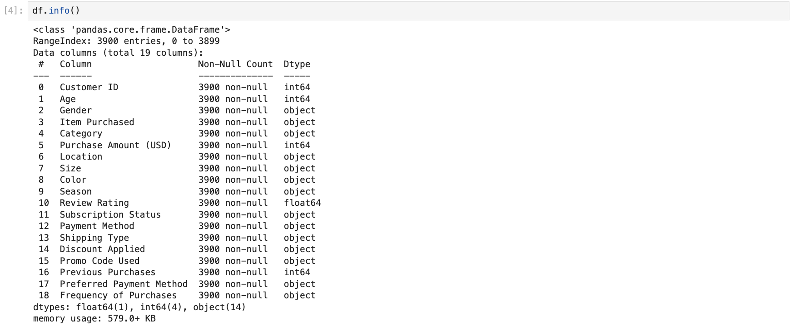
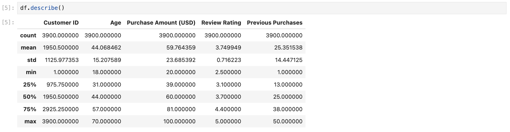
● Missing Data Handling: Checked for null values and imputed missing values in the
Review Rating column using the median rating of each product category.
● Column Standardization: Renamed columns to snake case for better readability and
documentation.
● Feature Engineering:
	○  Created age_group column by binning customer ages.
    ○  Created purchase_frequency_days column from purchase data.
● Data Consistency Check: Verified if discount_applied and promo_code_used
were redundant; dropped promo_code_used.
● Database Integration: Connected Python script to MySQL and loaded the cleaned
DataFrame into the database for SQL analysis.

4. Data Analysis using SQL (Business Transactions)
We performed structured analysis in MySQL to answer key business questions:
1. Revenue by Gender – Compared total revenue generated by male vs. female
customers.
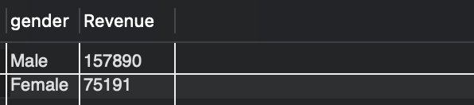
2. High-Spending Discount Users – Identified customers who used discounts but still
spent above the average purchase amount.
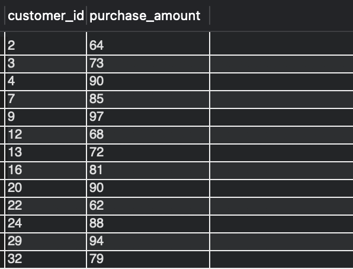

3. Top 5 Products by Rating – Found products with the highest average review ratings.
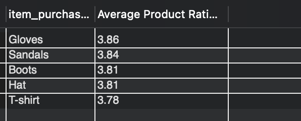

4. Shipping Type Comparison – Compared average purchase amounts between Standard and Express shipping.
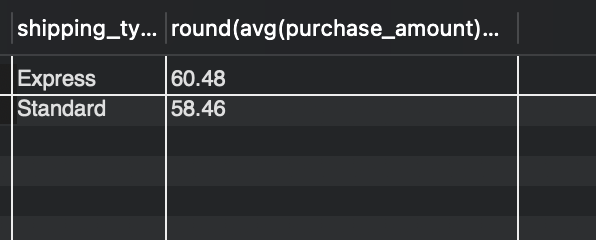

5. Subscribers vs. Non-Subscribers – Compared average spend and total revenue across subscription status.
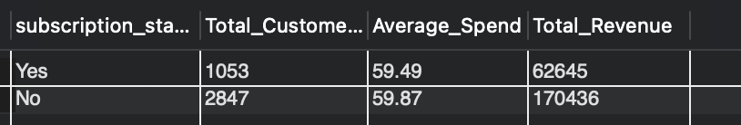

6. Discount-Dependent Products – Identified 5 products with the highest percentage of discounted purchases.
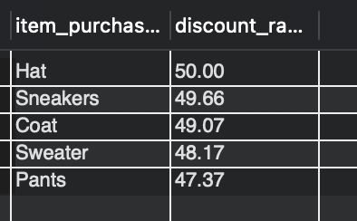

7. Customer Segmentation – Classified customers into New, Returning, and Loyal segments based on purchase history.
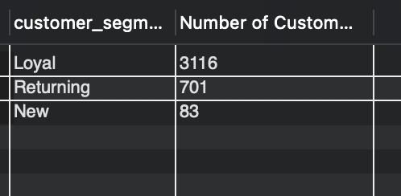

8. Top 3 Products per Category – Listed the most purchased products within each category.

9. Repeat Buyers & Subscriptions – Checked whether customers with >5 purchases are more likely to subscribe.
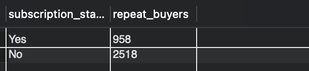

10. Revenue by Age Group – Calculated total revenue contribution of each age group.
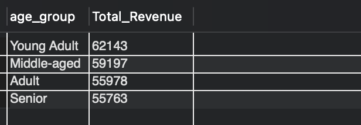

5. Dashboard in Power BI
Finally, we built an interactive dashboard in Power BI to present insights visually.
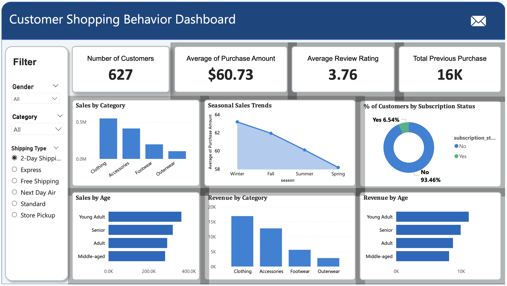
6. Business Recommendations
● Boost Subscriptions – Promote exclusive benefits for subscribers.
● Customer Loyalty Programs – Reward repeat buyers to move them into the “Loyal”
segment.
● Review Discount Policy – Balance sales boosts with margin control.
● Product Positioning – Highlight top-rated and best-selling products in campaigns.
● Targeted Marketing – Focus efforts on high-revenue age groups and express-shipping
users.
